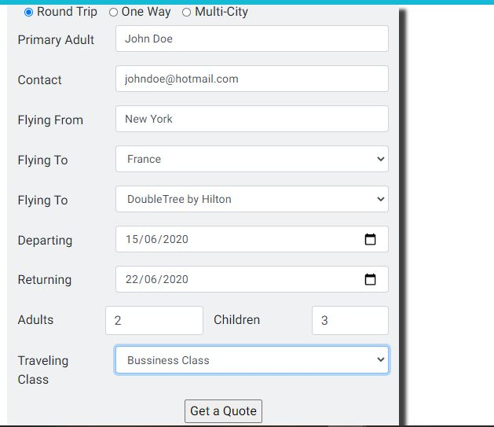
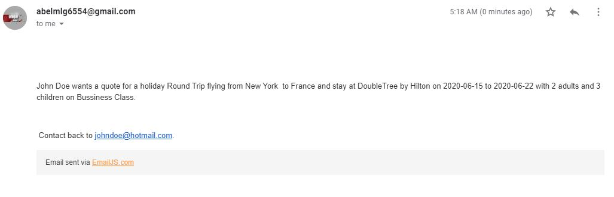

# Come Europe ReadMe

This is a holiday website promoting people to come visit different countries around plus giving potential customer a little insight about the continent too, with options of hotels to stay at and attractions to visit while you stay in these countries. The countries excluded on the website are England, France, Germany, Portugal, and Netherlands.

## UX

### User Stories

This website is targeted towards people looking for their next holiday destination. As a potential clients you wants to see a glimpse of the countries that I’m looking to visit and would want information about the accommodations provided through the website, those two factors would be the first essential thing I’ll be on the lookout for as client looking to book a holiday then ill be looks for thing to do while on holidays such as attractions.

### Strategy

The aim of this project is to design a website that highlights the best of part of Europe and the countries in it through a smooth and simple interactive website. Giving people who visit the sites multiple reasons to come and visit Europe on multiple devices such as computers, laptops, tablets, and phones.

### Scope

For the potential clients I wanted to give them an experience of the places you can go when you visit Europe and thing you can do while you are in those specific countries in Europe. While going information about the whole continent, attractions, and the hotels.For the potential clients I wanted to give them an experience of the places you can go when you visit Europe and thing you can do while you are in those specific countries in Europe. While going information about the whole continent, attractions, and the hotels.

### Structure

All the pages have the European banner at the top which is placed to make you mind to automatically associate this website with Europe so as soon as the site loaded you have an idea of what the website is about. The homepage has under the navigation bar a slogan that fades in after the website has been load and the grabbing the user’s attention and with the slogan swaying the user to come visit Europe. The homage also has images giving a glimpse of the parts of the continent and some information to about the history, nature and culture and art about Europe.
Each destination country page has options of hotels to stay at while in in those specific countries which images of the hotels and an overview of the hotel. The attractions page has a list of things to do while you are staying at your destination where you can check availability of the attractions. The about us page has information at the site and the location of the head office, with an email to contact to the site for inquires.

### Sketelon

### Surface

The colour scheme for the is different shades of blue with the main body being white which is a good contrast between the two colours.
With the banner being dark blue, the navigation bar and the footer has a background colour of sky blue which blends in the banner for the navigation bar and the contrast works well between the footer and the main body. Giving the website a smooth and professional blended colour scheme.

### Technology

- HTML
- CSS
- Bootstrap (4.4.1)
- Javascript

### Feature

The website uses google maps provided by the google cloud API which shows the geographic location of the destinations that are available, plus allowing the user to look at the area virtual and plan routes.  
There is also a booking form that connected to Email.JS so when the user fills in the form with their details and where they want to go and stay, where to details get sent to my email.
The site uses the carousel feature from bootstrap which is a slideshow for cycling through a series of pictures different sections of the hotel to show how to hotels will look like when they visit.

### Features Left to Implement

If I were to do this project again or have more time I actual put real hotels from a API such Expedia where the hotel details are actual located for that country.  I would also add an API for the booking form that has list of different airports so when the user types in their city it brings up a list of airports in that city, they can fly from allow the user to pick their preferred airport. Ill also add more attractions to the attraction page giving the users more options of or add link to travels sites like TripAdvisor.

### Testing

On the home you have three pictures of famous landmarks that are in Europe and underneath those pictures they have a button which leads the user to a text box with more information that relevant to the picture. In that text when a different button is clicked on by the user the text changes to present the relevant information while also directing them to the text box.

The navigation bar there is four links, where three on them when you click on them take you to a different page. The on that won’t take the user to a different page is the destination link but when the user hovers over the destination link a box with all countries that that the site has to offer and the box disappears when the mouse leaves the navbar or the box itself.

Each country has a hotels with a slideshow of different sections of the hotel with arrow for the user can flick through at their pace and beside that there’s a text box with an overview description about the hotel with a button that expands the overview giving the user more information but the hotel. In addition to expand the text box when the button is clicked on the text in the button is changed and the direction of the arrow change from down to an upwards direction.

There’s a booking form at the bottom on each country page where the user in fills their details of there personal information and what type of holiday they want to with how many people they going with and type of class they want to fly on. When the submit button is clicked on it sends all the data filled in the form and uses the information to fill in a temple on emailJS to and sends it to my email descripting what holiday the user wants. When filling out the form on the email section if you click on get a quote the form would get submitted and the adult number is over ten and less then one it wont work to and the children has to be greater than one.

The attraction page has a list on attractions that people can visit while they are staying in the respected country. When the page loads the attractions are just listed with the name of the attraction with a grey bar when the bar is click it on the it show more information about the attraction underneath with an image of the attraction and an a button where you can check the availability but leading the user to another site on a new tab so they can get easily get back to the website without losing the holiday website and still have access to other page allowing the user to switch between whenever they need through tabs.

The website has been tested on different browsers such as chrome and internet explorer, plus has been tested on multiple devices for example Iphone 6,7,8, X Samsung galaxy, pixel phone and iPad and iPad pro. On the mobile and tablet versions the box that comes up would not work out, so I changed it to a dropdown list. The navigation bar is also condensed into icon when clicked on expands showing all the links.

### Deployment

The website is hosted using GitHub pages, deployed directly from the master branch. The deployed site will automatically update new commits to the master branch. To deploy the site to correctly on GitHub pages, I named the home page index.html.

## Credits

### Content

The content on the homepage that in the textbox about “European history” comes from Wikipedia at https://en.wikipedia.org/wiki/History_of_Europe.

The “European natural” text on the homepage comes from a site called allthatsinteresting.com. The source can be located at https://allthatsinteresting.com/european-natural-wonders

The “European Art & culture” text on the homepage come from Wikipedia at https://en.wikipedia.org/wiki/Art_of_Europe.

The hotel sources:

- Citadines Islington London
  Expedia
  https://www.booking.com/hotel/gb/citadines-islington.en-gb.html
- DoubleTree by Hilton London
  https://www.tripadvisor.co.uk/Hotel_Review-g186338-d275581-Reviews-DoubleTree_by_Hilton_London_Westminster-London_England.html
- Novotel London Canary Wharf
  https://www.booking.com/hotel/gb/novotel-london-canary-wharf.en-gb.html?aid=356980&label=gog235jc-1DCAMoUDi1AkgJWANoUIgBAZgBCbgBF8gBDNgBA-gBAfgBAogCAagCA7gChLXQ9QXAAgE&sid=ff0e7dcd7b4c4574bab877e597816492&lp_sr_snippet=1#tab-main

The hotels on all the other countries page have all the same content.

The attraction page

- The London eye content source: https://www.visitlondon.com/things-to-do/place/282783-london-eye
- SEALIFE London content source: https://www.visitlondon.com/things-to-do/place/117322-sea-life-london
- Louvre Museum content source: https://www.cometoparis.com/paris-guide/what-to-do-in-paris-s938
- Disneyland Paris content source: https://www.disneylandparis.com/en-gb/information/

The content in the about us page is a primary source for the exception of the address of the head office which was fetched off a random address generator (https://www.randomlists.com/uk-addresses).

### Media

All the images on this website are retrieved from secondary sources, mostly from advanced google image search. Example such as the European banner, Eiffel tower and the London eye.

#### Images Source

- European banner source: https://upload.wikimedia.org/wikipedia/commons/b/b7/EUROPEAN-FOOTER.png
- Eiffel tower source: https://p1.pxfuel.com/preview/567/383/678/tower-eiffel-tower-paris-france-architecture-europe.jpg
- Art museum source: https://d2bgjx2gb489de.cloudfront.net/gbb-blogs/wp-content/uploads/2016/11/17181839/shutterstock_331790432.jpg
- London eye source: https://daysoutguidestorageprod.blob.core.windows.net/media-cache-prod/7/f/f/0/5/e/7ff05e18fed1707a749d758d9f8c7ee3fa6b864b.jpg
- SeaLife London source: https://img.grouponcdn.com/deal/hX5dWEmJ7scVfvQRKJ6k15cNTzc/hX-1000x600/v1/c700x420.jpg
- Louvre Museum source: https://francetravelblog.com/wp-content/uploads/2020/03/Visiting-the-Louvre-Museum-in-Paris-960x540.jpg
- Disneyland Paris source: https://fastpasstours.com/inspiration/wp-content/uploads/2019/04/disneyparis2.png
- Beach view source: https://ec4071ced0f087a8dd73-2a0aec697fc362de045ce5e0c53ec223.ssl.cf3.rackcdn.com/56d704988c1d8.jpeg
- Family on beach source: https://www.luxuryholidays.co.uk/images/holiday-types/family-holidays.jpg

### Acknowledgements
For the completion project I will have to give acknowledgement to the coding institute tutor for aided me throughout this project and being available to help when needed.
When started this project I did research on different holiday websites, while looking I took inspiration from a few websites such as https://www.onthebeach.co.uk/ and https://www.europeanbestdestinations.com/best-of-europe/ looking layout, colour scheme, pictures and content.  
pictures and content.  
The coding institute Putting It All Together Mini Project with Google Maps and EmailJS lesson were a big inspiration to this project, plus also allowing me to use the knowledge I have received from the coding institute and applying to my project.
During this project there were a few hurdles that I needed to overcome but with the assistant of websites such as stackflow and w3schools.com helped me overcome some of the problems that I encountered during this project.

